# 002.01_搭建GIT服务器
### 第一步：解压缩 Bitblit
解压缩 Bitblit 的压缩包，无需安装

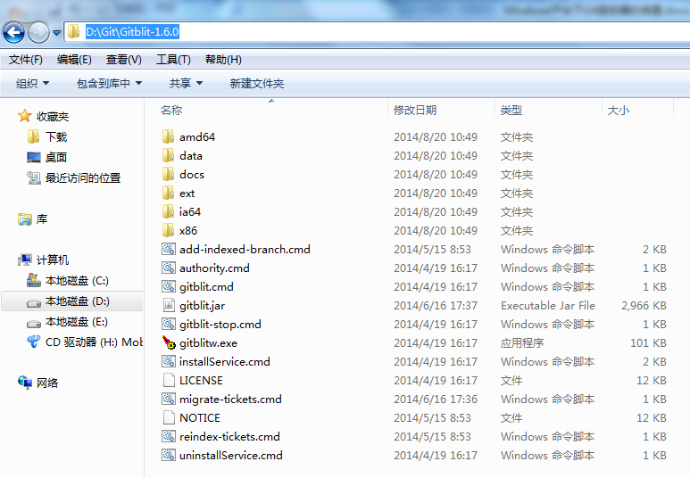

### 第二步：创建仓库集文件夹（可选）
创建用于存储资料的文件夹

### 第三步：配置gitblit（可选）
#### 1.找到gitblit.properties文件
找到Git目录下的data文件下的gitblit.properties文件，没有可以自己创建一个，“记事本”打开

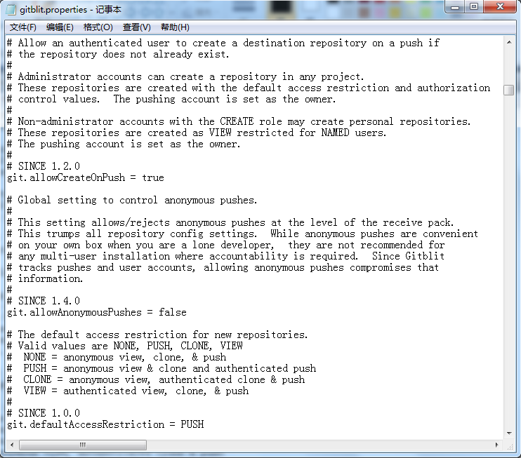

#### 2.设置仓库路径
找到git.repositoriesFolder(资料库路径)，赋值为第二步创建好的文件目录

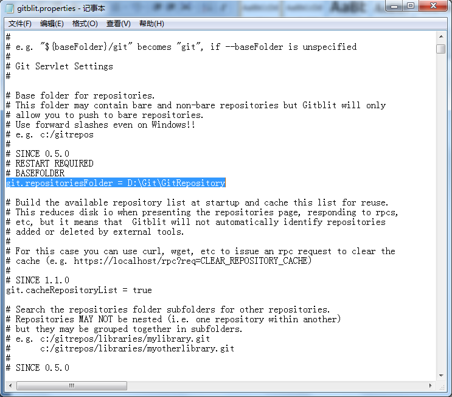

#### 3.设置 http 协议端口号
找到server.httpPort，设定http协议的端口号

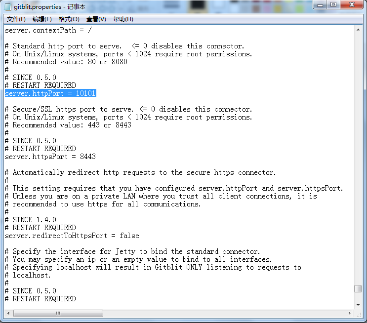

#### 4.设置 http 协议服务器ip地址
找到server.httpBindInterface，设定服务器的IP地址。这里就设定你的服务器IP

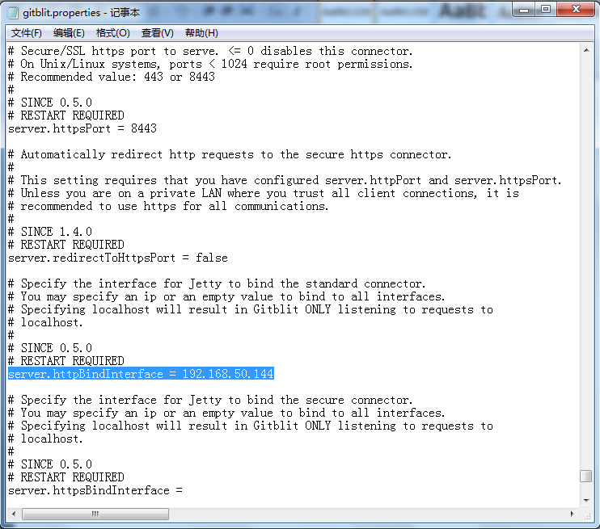

#### 5.设置 https 协议服务器ip地址
找到server.httpsBindInterface，设定为localhost

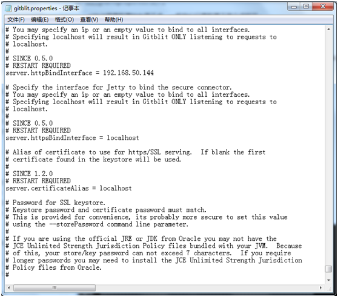

#### 6.保存，关闭文件

### 第四步：运行gitblit.cmd 批处理文件
#### 1.运行gitblit
找到gitblit目录中的gitblit.cmd文件，双击

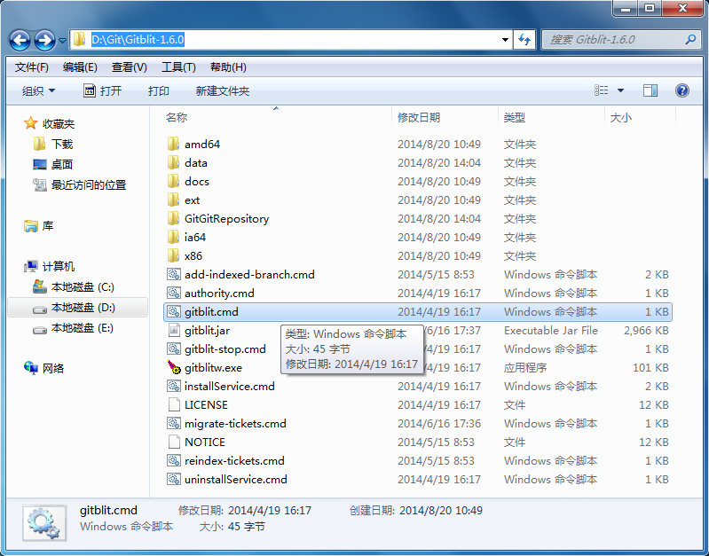

#### 2.运行结果如下，运行成功
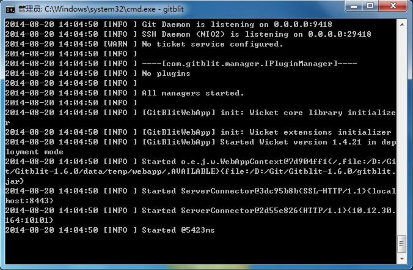

### 第五步：管理 Gitblit
在浏览器中打开,现在就可以使用GitBlit了

### 第六步：设置以Windows Service方式启动Gitblit（可选）
配置这项以后，每次开机会以服务的形式自动运行 gitblit

#### 1.在Gitblit目录下，找到installService.cmd文件
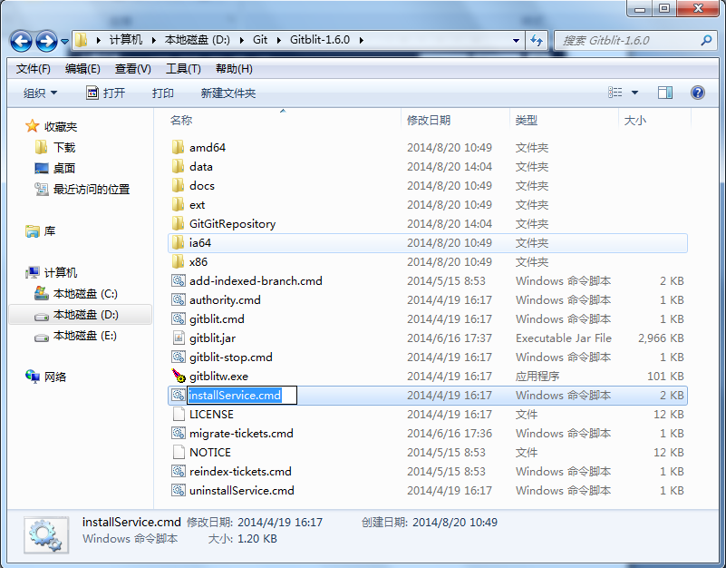

#### 2.用“记事本”打开
#### 3.修改 ARCH
32位系统：SET ARCH=x86
64位系统：SET ARCH=amd64

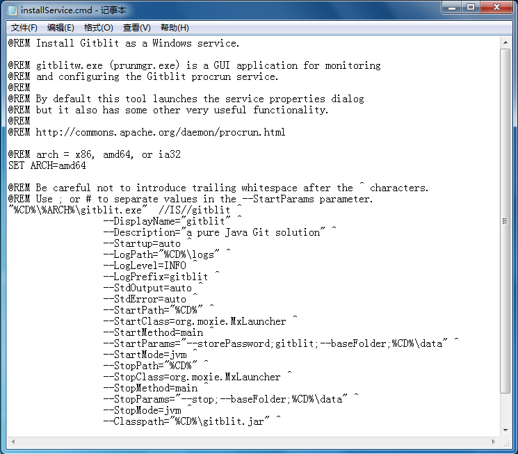

#### 4.添加 CD 为程序目录
SET CD=D:\Git\Gitblit-1.6.0(你的实际目录)

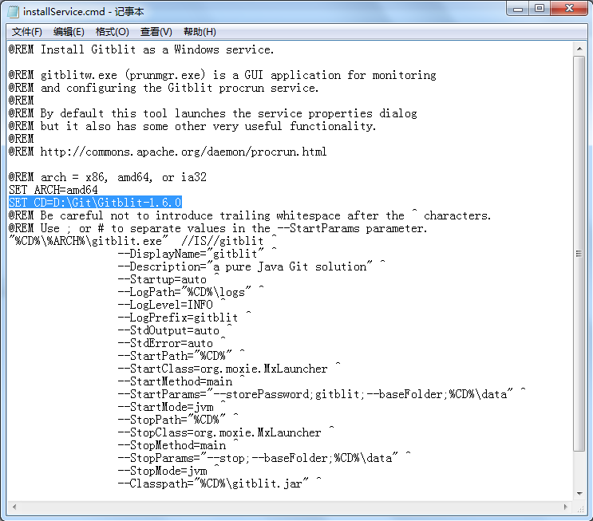

#### 5.修改StartParams里的启动参数，给空就可以了
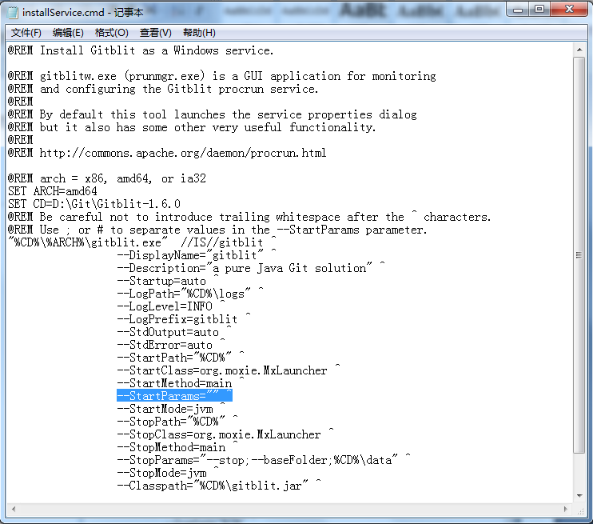

#### 6.保存，关闭文件

### 第七步：以Windows Service方式启动Gitblit
#### 1.双击Gitblit目录下的installService.cmd文件(以管理员身份运行)

#### 2.在服务器的服务管理下，就能看到已经存在的gitblit服务了
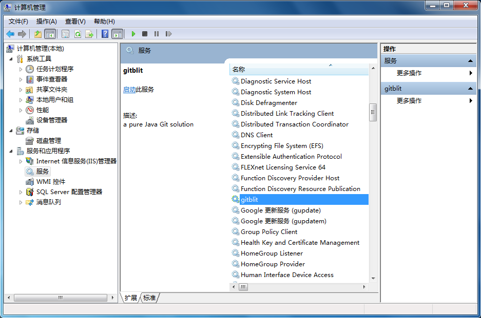

#### 3.平时使用时，保持这个服务是启动状态就可以了

以上就是Windows平台下，配置Git服务器的全部的全部内容。