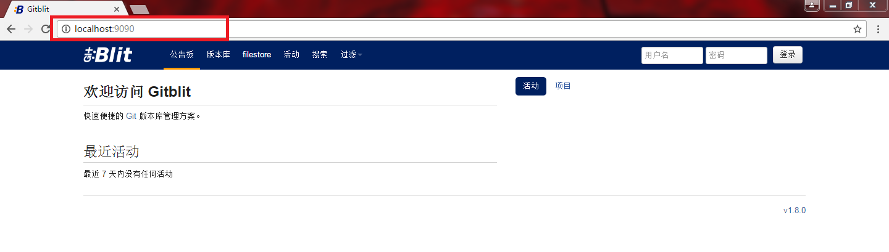
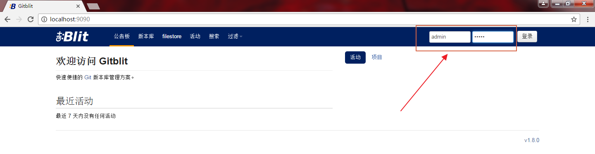
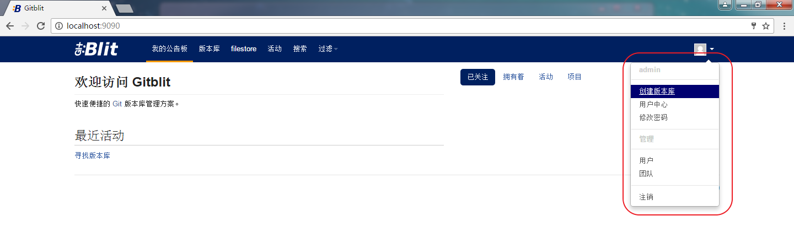
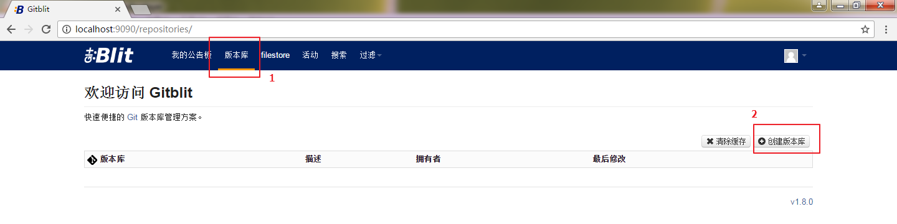
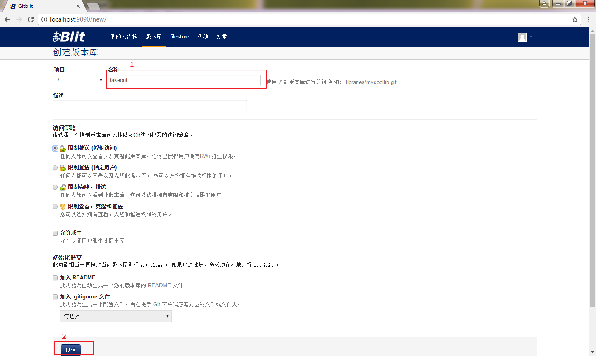
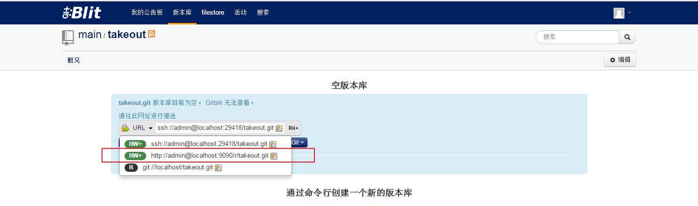

# 002.02_创建仓库
### 第一步：打开 Gitblit 管理界面
使用浏览器打开 localhost:9090 地址，9090 是在 git 服务器搭建的时候配置的 http 服务的端口号

### 第二步：登录 Gitblit 管理界面
使用用户名 admin 和 密码 admin 登录 gitblit 管理界面

### 第三步：创建版本库
#### 1.点击创建版本库按钮
方式一：

方式二：

#### 2.填写版本库名字，点击创建按钮

#### 3.查看创建好的版本库的Url地址
gitblit 支持 http https git ssh 协议，这里我们选择 http 或者 https 就行
