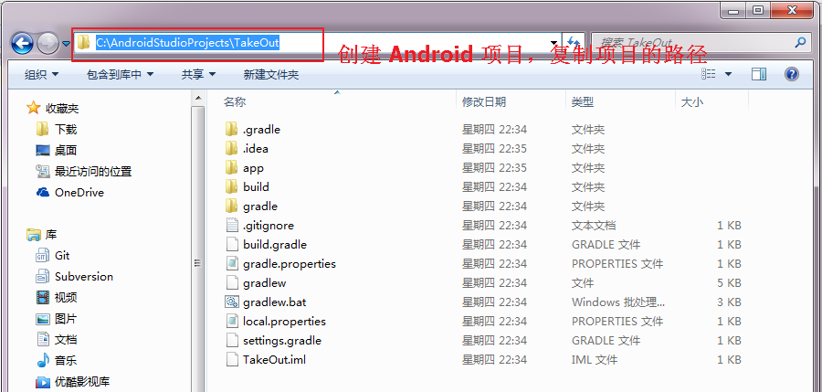
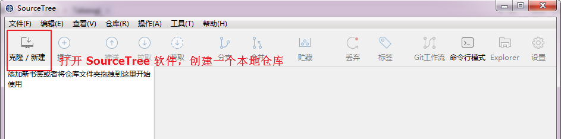
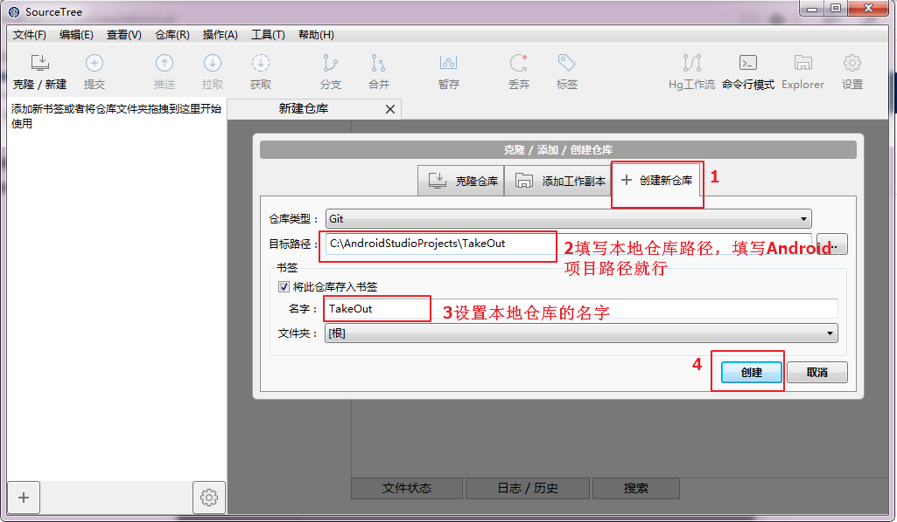
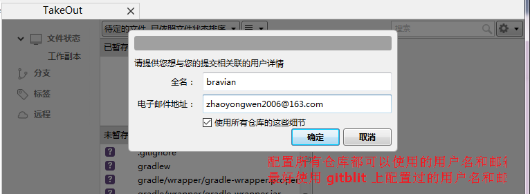
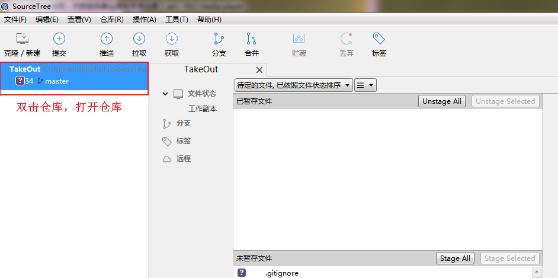
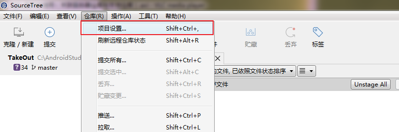
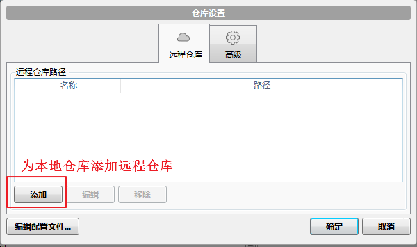
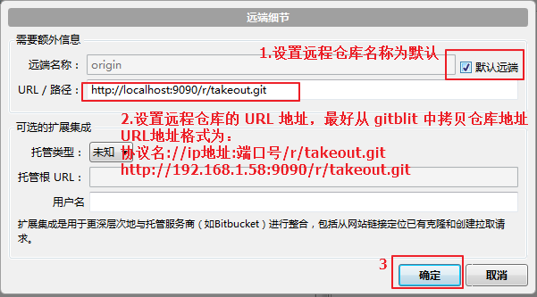

# 003.01_关联服务器仓库和本地仓库
## 学习目标
- 独立使用 SourceTree 创建本地 git 仓库
- 独立使用 SourceTree 关联服务器仓库和本地仓库

## 学习基础要求
- 理解版本控制基本的概念

## 引言和回顾

## 课堂内容
### 1. 使用 Android Studio 创建一个 Android 项目

### 2. 使用 SourceTree 创建本地仓库
#### 2.1.打开 SourceTree，创建本地仓库

#### 2.2.设置仓库路径和仓库名字

#### 2.3.设置全局用户名和邮箱
提交文件到本地仓库git要求必须配置用户名和邮箱，如果这里没有配置那么必须单独为某一个仓库配置用户名和邮箱

### 3. 配置本地仓库的远程仓库
#### 3.1.打开本地仓库

#### 3.2.打开仓库设置对话框

#### 3.3.为本地仓库添加远程仓库

#### 3.4.为本地仓库设置独有用户名和邮箱[可选]
