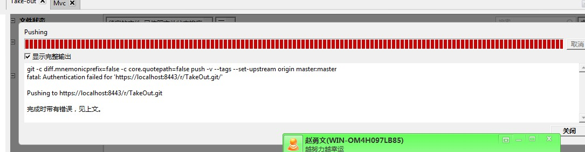

# 003.02_Git使用常见错误
### 1. push 到远处仓库失败

原因1: 用户名密码错误

    解决方案:到 sourcetree工具->选项->验证 中清空已经保存的用户名和密码
原因2: 使用的 git 服务器需要进行安全认证.

    解决方案: 取消服务器ca认证.
             在命令行中, 执行以下命令:
            git config --global --bool --add http.sslVerify false
            
