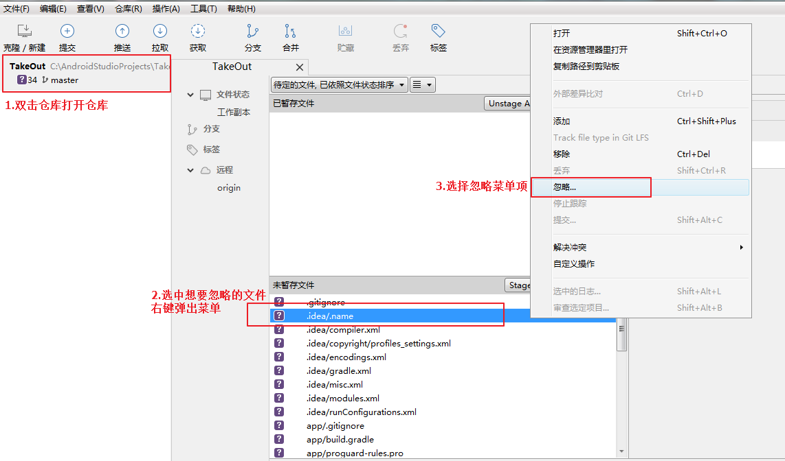
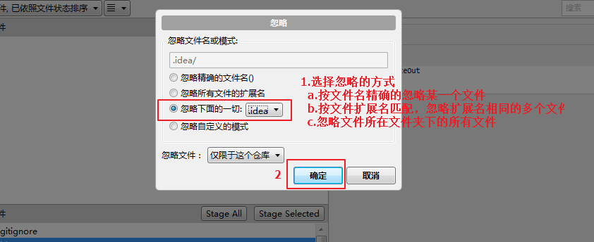
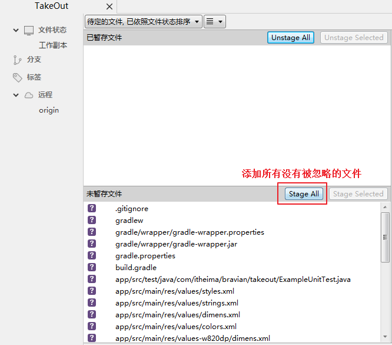
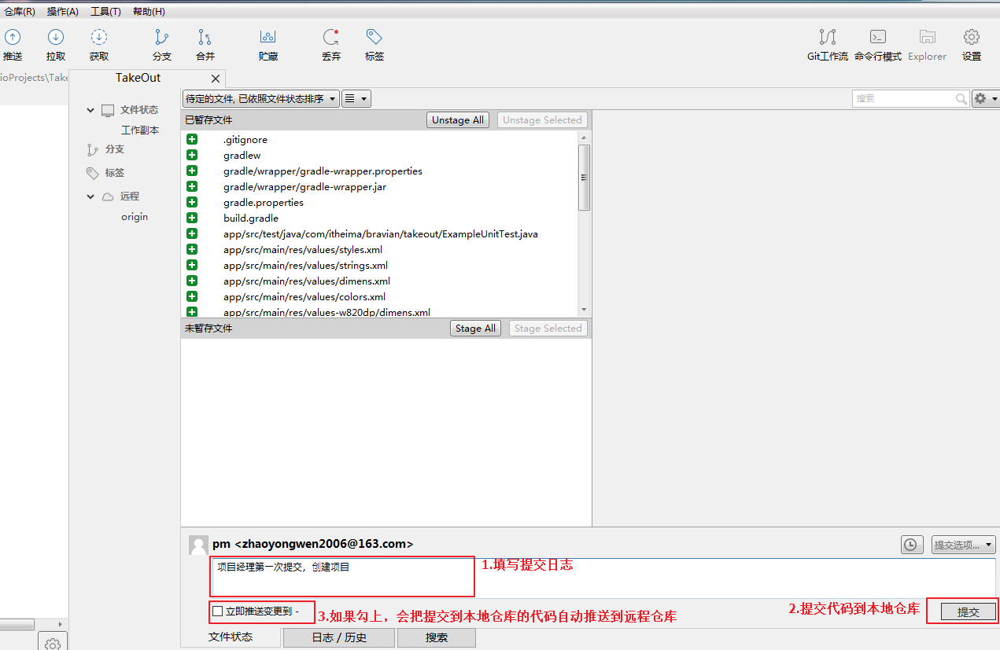
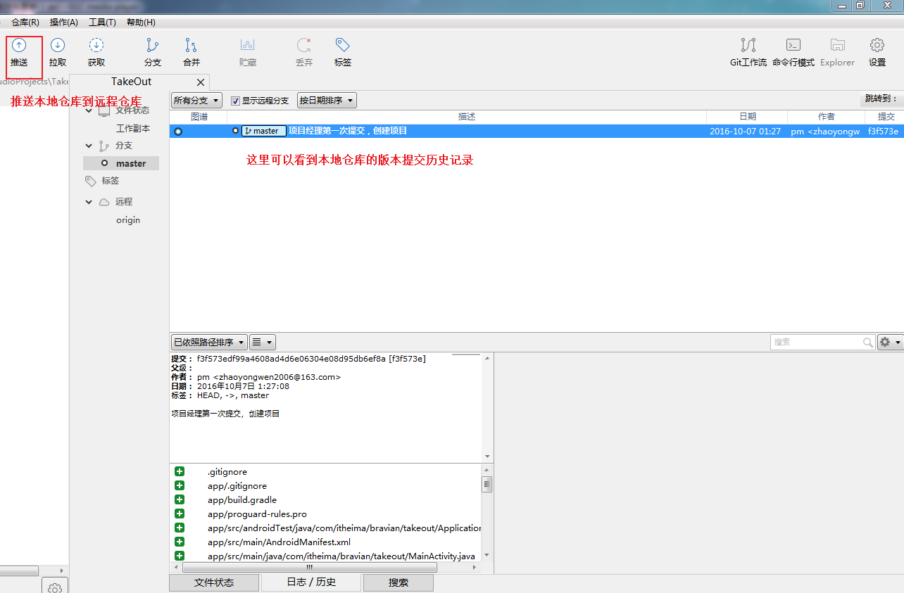
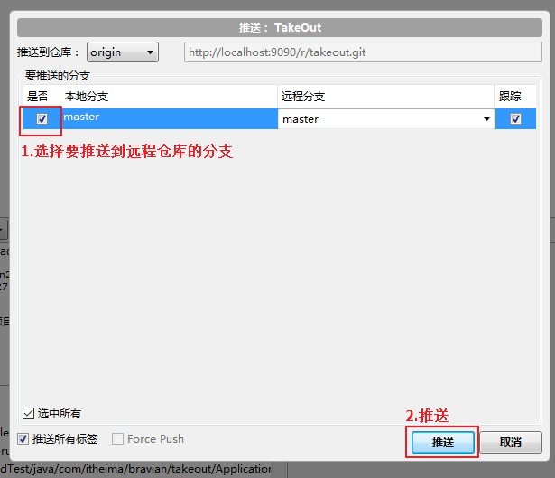
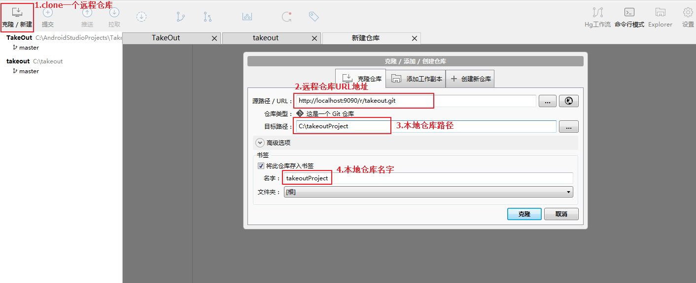

# 004_使用客户端_提交和更新代码_克隆仓库分支
## 学习目标
- 独立使用 SourceTree 配置忽略文件、提交和更新代码
- 独立使用 SourceTree 克隆仓库分支

## 学习基础要求
- 理解版本控制基本的概念

## 引言和回顾
在提交代码之前我们需要先配置忽略版本控制的文件，项目中只有IDE不会自动产生的文件才是必须要进行版本控制的文件，大家还记得 Android Studio 项目中哪些文件是必须的么

1. 所有的 .gradle 文件，比如 setting.gradle、build.gradle
2. module 下面的 src 目录，.gitignore文件，proguard-rules.pro文件

## 课堂内容
### 1. 提交代码到远程仓库
#### 1.1.配置忽略版本控制的文件
##### a.打开忽略配置对话框

##### b.配置忽略文件

##### c.添加要提交的文件

#### 1.2.提交代码到本地仓库

#### 1.3.推送本地仓库到远程仓库
##### a.打开推送对话框

##### b.推送分支到远程仓库

### 2. 从远处仓库clone分支到本地
