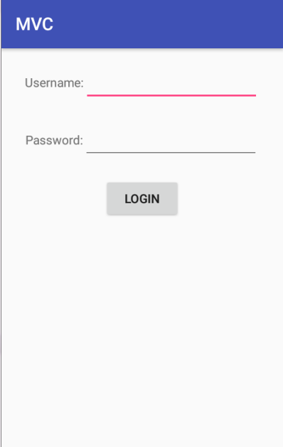

# 006.02_从MVC到MVP[重点]
## 学习目标
- 使用 MVP 架构对复杂项目进行模块拆分，耦合隔离，提高程序的可维护性和可读性
- 理解 MVP 模式各层代表的功能
- 记住 Android 中 MVP 模式包含典型代码
- 理解 Android 中 MVP 模式的优缺点，根据实际项目需求合理选择架构模式

## 学习基础要求
- 熟悉 android mvc 模式架构

## 引言和回顾
前面我们学过的项目都是 mvc 模式架构，这是 android 中典型的架构模式，现在大家来回忆一下，假如我们实现这样一个需求，使用 mvc 模式怎么写代码：

1. 一个登陆界面，用户可以输入用户名和密码，点击登陆按钮登陆
2. 用户登陆过程中，弹出一个进程条对话框，提示用户等待
2. 用户登陆成功之后，隐藏进度条对话框，弹出一个 toast 提示用户登陆成功
3. 用户登陆失败之后，隐藏进度条对话框，弹出一个 toast 提示用登陆失败

## 课堂内容
### 1. 使用 MVC 架构实现用户登陆
[MVC 讲完之后暂停，带同学仔细看看代码]

刚刚 MVC 模式中我们主要做了下面事情

    1. 创建界面对应的 View
    2. 通过 findviewbyid 找到这些 View 对象
    3. 初始化这些 View，setText、setImage 等等
    4. 处理用户交互
    
         1. 用户点击登录按钮
         2. 获取用户名和密码
         3. 检查用户名和密码，用户名和密码不能为空，否则提示用户输入
         4. 发送网络请求，把用户名和密码提交给服务器，服务器校验用户名和密码是否正确
         5. 处理服务器返回的结果，把结果反馈为用户
    5. 获取网络数据，填充界面

这里面所有的代码按照程序执行的流程可以分为，View、View控制逻辑、业务逻辑、纯数据 4种类型

2. MVP 架构

## 重点难点讲解
1.是否有复杂的业务逻辑 2.是否要进行数据缓存 和是否采用 mvp 其实比没有
关系

## 问题和练习
### 问题
1.MVC 中 v 包含哪些代码，c 包含哪些代码，m 包含哪些代码
从什么角度来拆分，拆分之后的结果，每层包含哪些部分

2.MVP 中 v 包含哪些代码，p 包含哪些代码，m 包含哪些代码
V：自定义view、Layout、Activity、Fragment，其中 Activity 和 Fragment 中承载 view 的控制逻辑
P：业务逻辑
M：javabean

### 练习

## 拓展和参考资料
- [google官方MVP架构例子](https://github.com/googlesamples/android-architecture)

    https://github.com/googlesamples/android-architecture