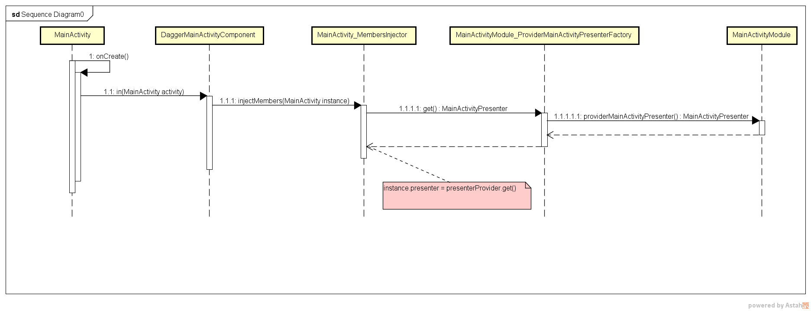

# 010_Dagger2原理深入解析
## 学习目标
- 理解 Dagger2 实现依赖注入原理
- 理解 Dagger2 注入函数的调用流程

## 学习基础要求
- 掌握 Dagger2 的使用步骤

## 引言和回顾
使用 Dagger2，虽然把以前一句代码可以搞定的对象创建和赋值现在拆分成 5 步才能搞定，麻烦了很多，但是使用 Dagger2 也有它的好处，就是当被注入的对象的构造函数发生变化的时候，只会引起 XXXModule 这个工厂类的变化，而不会引起所有使用被注入对象的类变化；如果需要注入另外一个对象，只需要修改 component 接口上的 @Component(modules = MainActivityPresenterModule.class) 注解的值。刚刚 5 步中最关键的一步就是调用 in 方法给 MainActivity 注入对象，下面我们就来分析这个 in 方法是怎么把对象注入进来的

## 课堂内容
### Dagger2实现注入的原理

## 拓展和参考资料
- [Android 利用 APT 技术在编译期生成代码](http://brucezz.itscoder.com/articles/2016/08/06/use-apt-in-android/)

    http://brucezz.itscoder.com/articles/2016/08/06/use-apt-in-android/
    