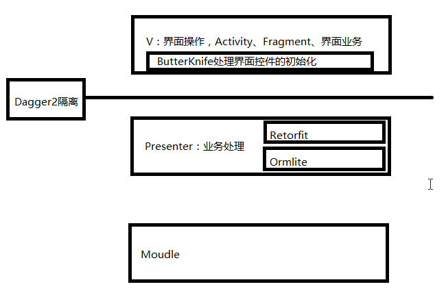

# 011_项目框架整合_分析项目整体结构
## 学习目标
- 了解使用 MVP+Dagger2+Retrofit2+ORMLite 项目的结构

## 引言和回顾
学完 MVP 和 Dagger2，下面我们学习使用 ButterKnife 来简化开发流程，提高开发效率。在开始下面内容之前我们先总览一下系统整个开发框架的结构，还有我们选择的各种开源工具在这个结构中所处的位置和作用

## 课堂内容
MVP+Dagger2+Retrofit2+ORMLite 类型项目结构

### 问题
1. Dagger2 在项目中的作用是什么？把 Presenter 对象注入 View 层

