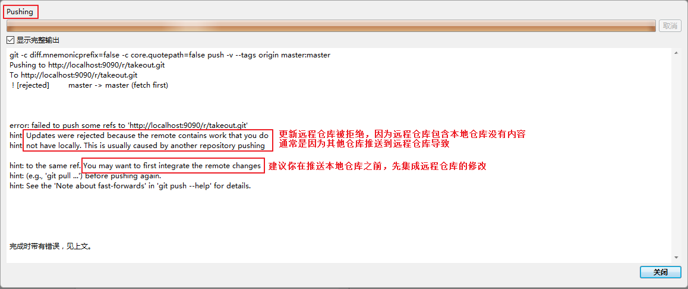
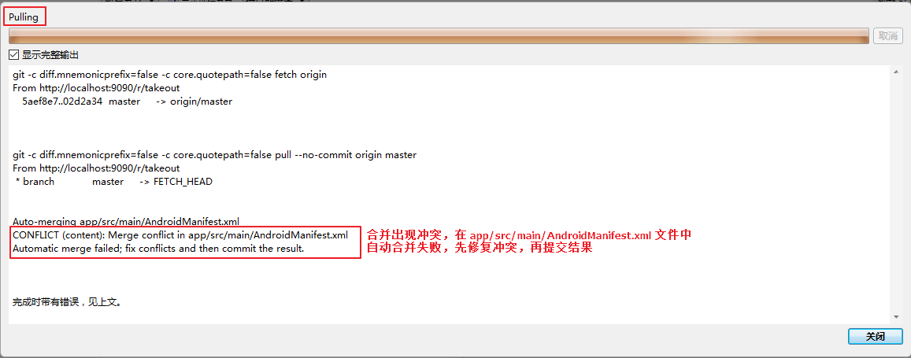
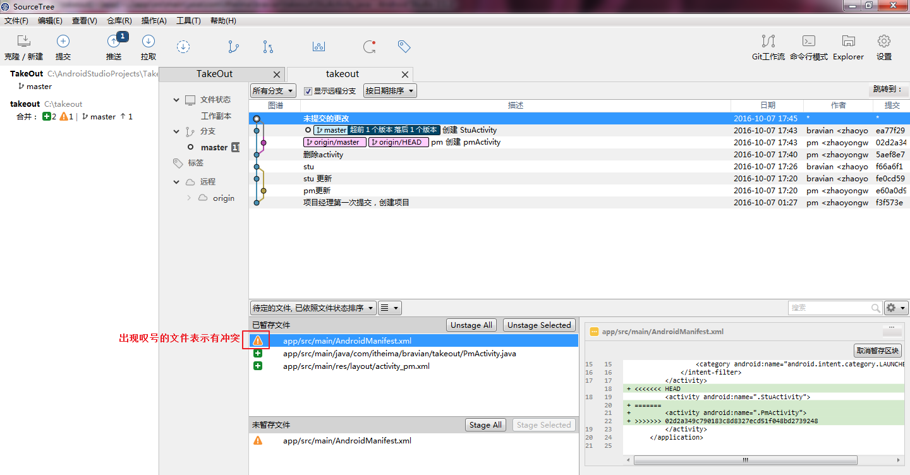
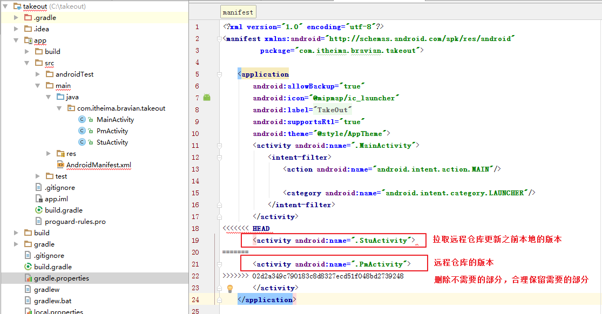
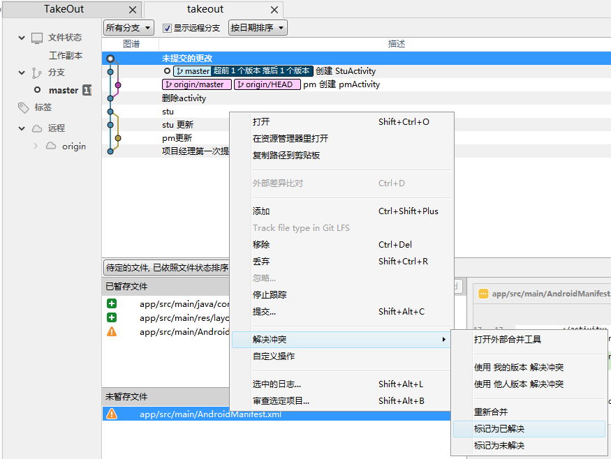
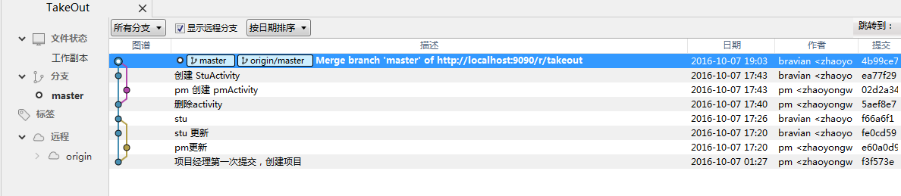
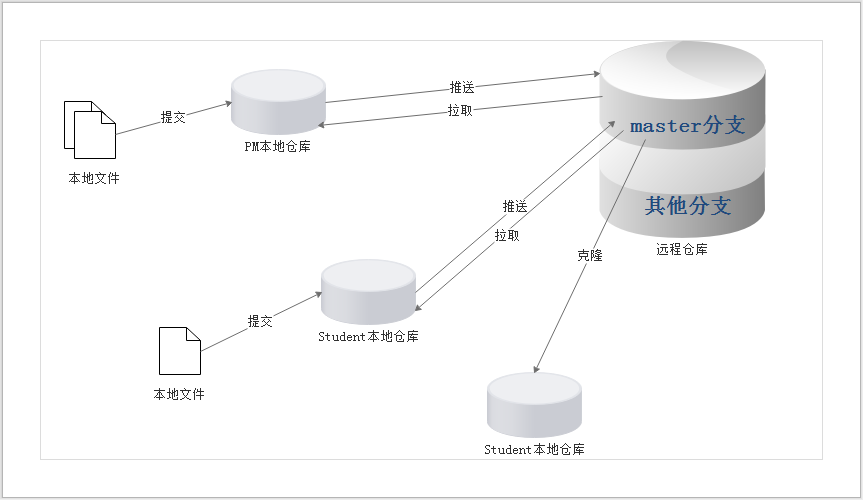

# 005_使用客户端_产生和解决冲突
## 学习目标
- 理解冲突产生的原因
- 熟练使用 SourceTree 解决冲突

## 学习基础要求
- 理解版本控制基本的概念

## 引言和回顾
刚刚我们已经有两个仓库，现在我们用 android studio 打开这两个仓库，模拟两个人分别对自己的仓库进行修改和提交，如果2个人同时修改到同一个文件的同一行代码，那么可能发生什么情况呢。对会发生冲突

git 中冲突的产生和 svn 中冲突的产生道理是一样的，冲突的解决方式也是一样的，大体上分为 3 步：

1. 先对比冲突文件，明白冲突的原因和位置
2. 解决冲突，根据原因选择保留的代码
3. 标记文件冲突已经解决

下面我们就来模拟一下这个产生这个冲突的过程和使用 sourcetree 来解决冲突

## 问题
1. 什么时候 SourceTree 会发现出现了冲突？

    对于同一个分支

    1. A向**本地仓库提交**了自己的更新
    2. A向**远程仓库推送**了自己的更新
    3. B向**本地仓库提交**了自己的更新
    4. B向**远程仓库推送**自己的更新，sourcetree 会提示推送失败，需要先拉取远程仓库更新
    
    5. B拉取远程仓库更新后，会发现本地仓库出现冲突，需要先解决冲突才能推送更新
    
    

2. 出现冲突怎么解决？
    1. 打开有冲突的文件，手动解决冲突
    
    2. 标记冲突已经解决
    

3. 理解下面这个图数据传递的流程

每个仓库中可以有多个分支，远程仓库中有多个分支，本地仓库中也有多个分支，每次提交、推送、拉取都是对某个分支进行的操作

## 扩展

给sourcetree配置图形化对比工具beyondCompare工具

- 安装beyondCompare
 
- 配置.gitconfig文件

    * sourcetree安装成功以后,会在 C:\users\xxx\生成.gitcofnig文件,找到该文件,添加以下配置内容:
    
    
        [user]
	name = fly
	email = fly@itcast.cn
        [http]
         	sslVerify = false
         	sslVerify = false
         	sslVerify = false
        [core]
         	excludesfile = C:\\Users\\ywf\\Documents\\gitignore_global.txt
         [difftool "sourcetree"]
         	cmd = 'C:/Program Files/Beyond Compare 4/BComp.exe' \"$LOCAL\" \"$REMOTE\"
         [mergetool "sourcetree"]
         	cmd = 'C:/Program Files/Beyond Compare 4/BComp.exe' \"$LOCAL\" \"$REMOTE\" \"$BASE\" \"$MERGED\"
         	trustExitCode = true
         [mergetool]
         	keepBackup = false
         [diff]
         	tool = bc3
         [difftool "bc3"]
         	path = C:\\Program Files\\Beyond Compare 4\\BComp.exe
         
    
- sourcetree集成beyondCompare

    * sourcetree - 工具 – 选项-比较重,对比和合并工具选中compare
 

