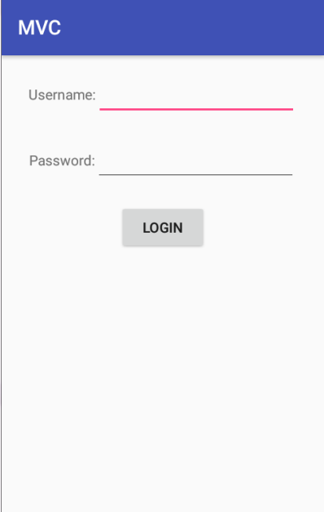
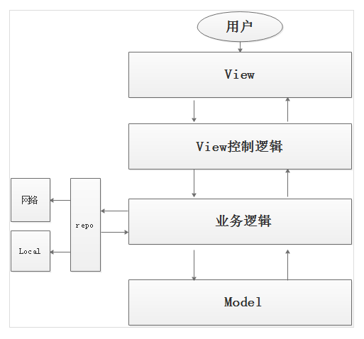

## 学习目标

* 使用 MVP 架构对复杂项目进行模块拆分，耦合隔离，提高程序的可维护性和可读性
* 理解 MVP 模式各层代表的功能
* 记住 Android 中 MVP 模式包含典型代码
* 理解 Android 中 MVP 模式的优缺点，根据实际项目需求合理选择架构模式

## 回顾

### mvc框架模式
#### mvc模式结构:

- Model（模型）

	 代表了描述网络请求、数据库操作、数据模型的一系列类的集合
- View（视图）

	代表了UI组件，像View，Activity，他只负责展示从controller接收到的数据
	
- Controller（控制器）
 
    它通过View来接受用户的输入，之后利用Model来处理用户的数据，最后把结果返回给View
	
#### 模型图:


#### 流程图:


####　缺陷

      
- 缺点:

      view和Controller耦合性太高.不易于维护


### mvp框架模式

#### 框架结构

Model（模型）

	代表了描述网络模型、数据库操作、数据模型的一系列类的集合
View（视图）

	代表了UI组件，像View，Activity，负责数据展示
Presenter（主持者）

    负责处理View或者activity中所有的UI以及UI事件，它通过View接收用户输入，之后利用Model来处理用户的数据，最后把结果返回给View

#### 模型图


#### 流程图


#### 优点

- 降低耦合
- 可维护性高
- 便于单元测试


## 引言

前面我们学过的项目都是 mvc 模式架构，这是 android 中典型的架构模式，现在大家来回忆一下，假如我们实现这样一个需求，使用 mvc 模式怎么写代码：

1. 一个登陆界面，用户可以输入用户名和密码，点击登陆按钮登陆
2. 用户登陆过程中，弹出一个进程条对话框，提示用户等待
3. 用户登陆成功之后，隐藏进度条对话框，弹出一个 toast 提示用户登陆成功
4. 用户登陆失败之后，隐藏进度条对话框，弹出一个 toast 提示用登陆失败



## 课堂内容

### 1. 使用 MVC 架构实现用户登陆

为了表达方便，现在统一一下说法，后面我说MVC里面分层中，Model 层就简称 M，View 层简称 V，Controller 层就简称 C，同理 MVP 里面，Presenter 层简称 P，android 中的 View 类还是用 View 来表述


[MVC 模式](/006.01_MVC模式.md )

Android 的 MVC 模式中

```
V 包含 Layout 文件和自定义 View
C 包含 Activity 和 Fragment 这种控制器，或者是前面智慧北京项目中的各种 Pager，GooglePlay 项目中的各种 Holder
M 就是纯粹的 JavaBean
```

这里面 V 和 M 都很好理解，C 稍微有点难，C里面到底做了一些什么事呢？刚刚 MVC 模式中 Activity 里我们主要做了下面事情

1. 创建界面对应的 View
2. 通过 findviewbyid 找到这些 View 对象
3. 初始化这些 View，比如 setText、setImage 等等
4. 处理用户交互

   1. 用户点击登录按钮
   2. 获取用户名和密码
   3. 检查用户名和密码，用户名和密码不能为空，否则提示用户输入
   4. 发送网络请求，把用户名和密码提交给服务器，服务器校验用户名和密码是否正确
   5. 处理服务器返回的结果，把结果反馈为用户

5. 获取网络数据，填充界面

MVC里面所有的代码按照程序执行的流程可以分为，View、View控制逻辑、业务逻辑、纯数据 4种类型



### 2. 使用 MVP 架构实现用户登陆

[MVP模式](/006.02_MVP模式.md )

搞懂 MVC 之后再理解 MVP 也就容易，和 MVC 比较，MVP 就是把界面控制逻辑和业务逻辑拆分开了，界面控制逻辑还是在 Activity 和 Fragment 中，只不过它们现在属于 V 层了；而业务控制逻辑属于 P 层，P 不直接控制 view，只需要完成业务在需要界面的时候，通知一下 V 层刷新界面就行；M 层还是原来的纯粹的数据模型。

)

MVC 改造成 MVP 模式之后，代码的执行流程还是原来那样没有任何变化，代码量也没有减少，只是代码放的位置和以前不一样。


## 问题

#### 1. MVC 中 V 包含哪些代码，C 包含哪些代码，M 包含哪些代码

```
M：JavaBean
V：自定义View、Layout
C：Activity、Fragment 界面控制逻辑，业务逻辑
```

#### 2. MVP 中 V 包含哪些代码，P 包含哪些代码，M 包含哪些代码

```
M：JavaBean
V：自定义View、Layout、Activity、Fragment，其中 Activity 和 Fragment 中承载着和 view 直接打交道的界面控制逻辑
P：业务逻辑
```

怎么界定哪些代码属于界面控制逻辑，哪些代码属于业务逻辑，其实这并不是非常严格，每个人分层出来的代码有一点差别是允许的，怎么分呢，就一句话，和 android 中的 View **直接**打交道的就是界面控制逻辑，其它的都可以算业务逻辑。

#### 3. MVP 的优点和缺点，MVP模式适合使用场景

```
优点：降低耦合,可维护性高
缺点：
    类的数量变多
    view和presenter交互比较频繁,联系过于紧密
    一旦视图发生变化,presenter层也随着发生变化
    
适用场景：业务逻辑比较复杂的应用
```


## 拓展和参考资料


- [一步一步实现Android的MVP框架](http://dev.qq.com/topic/5799d7844bef22a823b3ad44)

   http://dev.qq.com/topic/5799d7844bef22a823b3ad44
   
- [业务逻辑相关概念](/006.03_业务逻辑相关概念.md)


- [google官方MVP架构例子](https://github.com/googlesamples/android-architecture)

   https://github.com/googlesamples/android-architecture


