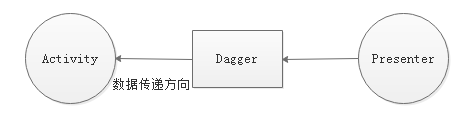

# 007\_降低耦合度的方式方法

## 学习目标

* 理解什么是构造函数耦合
* 了解解除构造函数耦合的几种方式
* 理解依赖注入的作用

## 学习基础要求

* 理解依赖和耦合的含义

## 引言和回顾

前面高新技术中，已经给大家介绍过依赖和依赖注入的概念，大家回顾一下，什么是依赖，什么是依赖注入？  
如果 A 类中使用到 B 类的对象，就叫做 A 类依赖于 B 类，这就好像人依赖于大脑一样，如果人的大脑不存在，那么这个人也不会存在；如果 B 类不存在，那么 A 类也不会存在，首先编译都通不过！  
依赖注入就是 B 类对象不是在 A 类中创建的，而是其它地方创建的，然后传递给 A 类使用，一般有 3 种传递方式，1.通过A类构造函数传递给A类对象；2.通过A类方法参数传递给A类对象；3.通过其它类的方法的返回值传递给A类对象。  
依赖可能导致一个问题，就是变化的传递，如果 B 类发生啦变化，可能，导致 A 类也发生变化，发生这种情况，就叫做A类和B类耦合性非常高。刚刚我们写的 MVP 模式中就有这种依赖，MVP 模式中谁依赖于谁，对， V 和 P 是相互依赖的，P 和 M 是相互依赖的，好，下面我们就来学习怎么解决 V 和 P 的构造函数耦合性非常高的问题。

## 课堂内容

### 1.解决构造函数导致耦合的方式

1. 配置文件 ＋ 反射
2. 单例模式、工厂模式 等等

### 2.Dagger2 解决构造函数耦合的实现步骤

1. new Presenter
2. 把 Presenter 设置给 Activity 的成员

