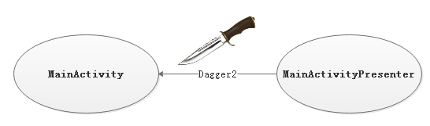

# 009_使用Dagger2
## 学习目标
- 熟练掌握 Dagger2 的基本使用步骤

## 学习基础要求
- 了解 Dagger2 的作用

## 引言
前面我们在开源项目的课程中，已经介绍过 Dagger2 的使用，它是在 Java 和 Android 中用来依赖注入的类库。在这个项目中我们就会用到 Dagger2 来进行层和层之间的隔离。

## 回顾

### dagger2的使用
使用dagger2实例对象,需要用到四个注解:

@inject: 声明需要依赖注入的对象. 
@module: 提供依赖对象的容器
@provider: 声明提供实例对象
@component: 将moudle中提供的实例对象复制给使用@inject声明的对象.


## 课堂内容
### Dagger2使用步骤
我们打算不修改 MainActivityPresenter 代码，把 MainActivityPresenter 对象注入 MainActivity 中




#### 1.完成 Dagger2 的使用环境配置
1.在 Project 的 build.gradle 文件添加 apt 工具的 gradle 插件

```java
buildscript {
    repositories {
        jcenter()
    }
    dependencies {
        classpath 'com.android.tools.build:gradle:2.1.2'
        // 添加 apt
        classpath 'com.neenbedankt.gradle.plugins:android-apt:1.8'
    }
}
```
2.在 Module 的 build.gradle 文件引入 apt 插件和 dagger2

```java
apply plugin: 'com.android.application'
// 引入 apt 插件
apply plugin: 'com.neenbedankt.android-apt'
......
dependencies {
    compile fileTree(include: ['*.jar'], dir: 'libs')
    compile 'com.android.support:appcompat-v7:24.2.1'
    // 添加 dagger2
    compile 'com.google.dagger:dagger:2.6'
    apt 'com.google.dagger:dagger-compiler:2.6'
}
```

#### 2.使用 @inject 注解，标识要注入的成员
在 MainActivity 中使用 @inject 注解，标识要注入的成员

```java
public class MainActivity extends AppCompatActivity {
    @Inject
    MainActivityPresenter presenter;

    @Override
    protected void onCreate(Bundle savedInstanceState) {
        super.onCreate(savedInstanceState);
        setContentView(R.layout.activity_main);
    }
    ......
}
```

#### 3.创建 XXXModule 工厂类
创建 MainActivityPresenter 类的工厂类 MainActivityPresenterModule，该工厂类可以创建 MainActivityPresenter 实例

1. 使用 @Module 注解表示该类是一个 Module 类，可以提供一些实例用于注入
2. 使用 @Provides 注解指明哪一个方法可以创建实例对象

```java
/**
* @Module注解表示这个类提供生成一些实例用于注入
*/
@Module
public class MainActivityPresenterModule {
    private MainActivity activity;

    public MainActivityModule(MainActivity activity) {
        this.activity = activity;
    }

    /**
     * @Provides 注解表示这个方法用来创建某个实例对象，方法名自己定，但一般用provideXXX结构，方法可以有参数，但还需要其它 provide 方法来给参数注入对象，这里不讲，可以参考拓展文档
     * @return 返回注入对象
     */
    @Provides
    public MainActivityPresenter provideMainActivityPresenter(){
        return new MainActivityPresenter(activity);
    }
}
```

#### 4.创建连接器接口
创建 MainActivity 和 MainActivityPresenterModule 之间的连接器 MainActivityComponent 接口

1. 使用 @Component 注解标记一个接口，表示要是使用哪些 module 类来进行依赖注入
2. 给接口添加一个方法，用来给参数对象注入对象

```java
/**
*用 @Component 注解标识这个接口是一个连接器，能用 @Component 注解的只
*能是接口或者抽象类
*/
@Component(modules = MainActivityPresenterModule.class)
public interface MainActivityComponent {
    /**
     * 这里 in 是 inject 的缩写表示注入的意思，这个方法名可以随意更改，但建议就
     * 用in或者inject。
     */
    void in(MainActivity activity);
}
```

#### 5.注入 MainActivityPresenter 对象
先编译项目，然后在 MainActivity 中调用 DaggerMainActivityComponent 的方法注入 MainActivityPresenter 对象

```java
 DaggerMainActivityComponent.builder()
    .mainActivityPresenterModule(new MainActivityPresenterModule(this))
    .build()
    .in(this);
```

1. DaggerMainActivityComponent类是 apt 工具自动产生的
2. DaggerMainActivityComponent.builder() 后调用 mainActivityPresenterModule 方法是给 Builder 类设置 Module 对象，由于我们的 Module 类的构造方法带有参数，所以需要我们自己 new Module 对象，否则 Module 对象是可以自动产生


## 参考资料
- [Dagger2 使用详解](http://www.jianshu.com/p/94d47da32656)

    http://www.jianshu.com/p/94d47da32656
    
- [带着疑惑走进Dagger2](http://blog.csdn.net/ghost_programmer/article/details/52416432)

    http://blog.csdn.net/ghost_programmer/article/details/52416432
    
