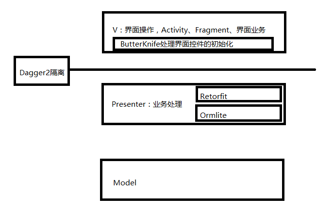
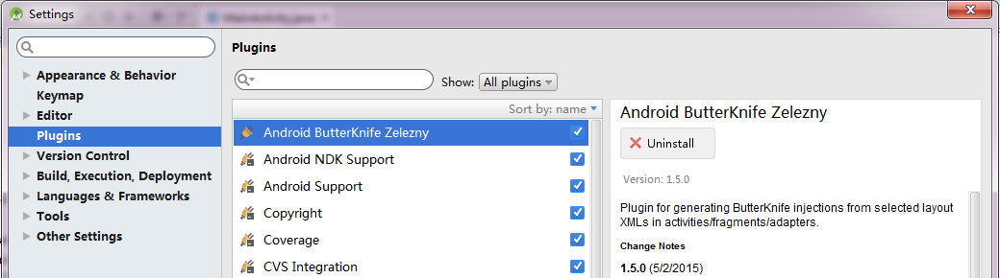

# 012_整合ButterKnife
## 学习目标
- 熟练使用 ButterKnife 进行 View 的注入
- 理解 ButterKnife 的原理

## 学习基础要求

## 引言和回顾
学完 MVP 和 Dagger2，下面我们学习使用 ButterKnife 来简化开发流程，提高开发效率。在开始下面内容之前我们先总览一下系统整个开发框架的结构，还有我们选择的各种开源工具在这个结构中所处的位置和作用



ButterKnife 大家已经用得非常6啦，现在我们再来快速回顾一下。

## 课堂内容
### 1.ButterKnife7 及以下版本的使用方法
1.1. 在 module 的 build.gradle 文件中添加 ButterKnife 的依赖
```java
dependencies {
    ....
    
    // 添加ButterKnife
    compile 'com.jakewharton:butterknife:5.1.1'
}
```
1.2. 在 Activity 或者其他 View 控制器类中使用 @InjectView 注解，标识要注入的 View 对象
```java
@InjectView(R.id.username)
EditText mUsername;
@InjectView(R.id.password)
EditText mPassword;
```
1.3. 在使用注入的 View 之前，调用 ButterKnife.inject() 方法启动注入
```java
@Override
protected void onCreate(Bundle savedInstanceState) {
    super.onCreate(savedInstanceState);
    setContentView(R.layout.activity_main);
    //注意正确选择 inject 的重载方法
    ButterKnife.inject(this);
}
```

### 2.使用 ButterKnife Zelezny 插件自动产生上述代码



### 3.ButterKnife8 的使用方法
butterknife 8 使用了 apt 技术来提高程序的运行效率

3.1. 在 Project 级别的 build.gradle 中添加 apt 插件
```java
buildscript {
  repositories {
    mavenCentral()
   }
  dependencies {
    classpath 'com.android.tools.build:gradle:2.1.2'
    //apt插件
    classpath 'com.neenbedankt.gradle.plugins:android-apt:1.8'
  }
}
```

3.2. 在 Module 的 build.gradle 中引用插件和添加 ButterKnife 依赖
```java
apply plugin: 'com.android.application'
//引用插件
apply plugin: 'android-apt'

android {
    ...
}

dependencies {
    //ButterKnife 依赖 
    compile 'com.jakewharton:butterknife:8.4.0'
    apt 'com.jakewharton:butterknife-compiler:8.4.0'
}
```

3.3. 在 Activity 或者其他 View 控制器类中使用 @BindView 注解，标识要注入的 View 对象
```java
@BindView(R.id.username)
EditText mUsername;
@BindView(R.id.password)
EditText mPassword;
```

3.4. 在使用注入的 View 之前，调用 ButterKnife.bind() 方法启动注入
```java
@Override
protected void onCreate(Bundle savedInstanceState) {
    super.onCreate(savedInstanceState);
    setContentView(R.layout.activity_main);
    //注意正确选择 bind 的重载方法
    ButterKnife.bind(this);
}
```

ButterKnife Zelezny 插件可以自动识别 ButterKnife 版本，自动产生不同的代码。


## 问题和练习
### 问题
1. 被注入的 View 对象是什么时候注入的
2. ButterKnife.inject 方法选择哪一个


## 拓展和参考资料
- [butterknife github](https://github.com/JakeWharton/butterknife) 

    https://github.com/JakeWharton/butterknife
    
- [butterknife 官网](http://jakewharton.github.io/butterknife/)    

    http://jakewharton.github.io/butterknife/
