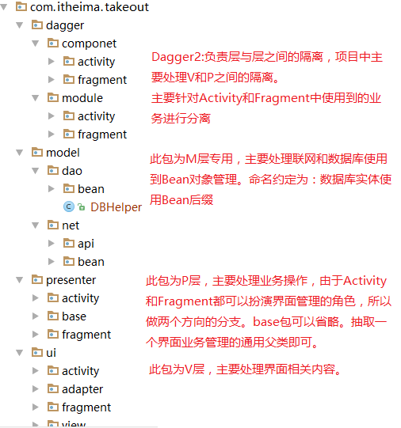

# 022_项目框架整合_包结构划分
## 学习目标
- 了解使用 MVP+Dagger2+Retrofit2+ORMLite 项目包的结构

## 学习基础要求
- 熟悉 Android 中的 MVP 架构
- 熟悉 Dagger2 的基本使用
- 熟悉 Retrofit2 的基本使用
- 熟悉 ORMLite 的基本使用

## 引言和回顾
到此为止，咱们项目的框架和技术方案选型就算定下来啦，也把每个工具类库的基本使用都回顾了一遍。下面我们就可以把这些库都整合到 MVP 架构中来，正式开始外卖这个项目了。写代码之前先建包，那么采用 MVP+Dagger2+Retrofit2+ORMLite 这种项目，一般怎么设计包的结构，下面先大概浏览一下

## 课堂内容
MVP+Dagger2+Retrofit2+ORMLite 类型项目包结构

## 重点难点讲解

## 问题和练习
### 问题
1.MVP+Dagger2+Retrofit2+ORMLite 类型的项目一级包一般包含哪些？
model、presenter、ui、dagger

### 练习

## 拓展和参考资料