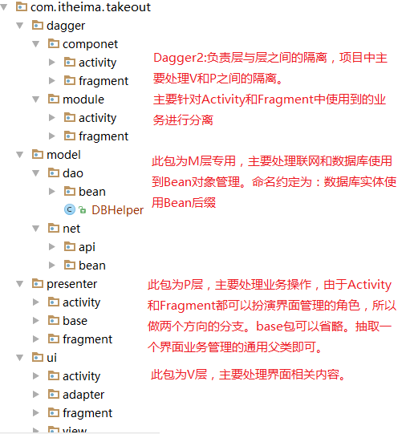

# 023_项目框架整合_包结构和常用类的创建
## 学习目标
- 熟悉使用 MVP+Dagger2+Retrofit2+ORMLite 项目包的结构

## 学习基础要求
- 熟悉 Android 中的 MVP 架构
- 熟悉 Dagger2 的基本使用
- 熟悉 Retrofit2 的基本使用
- 熟悉 ORMLite 的基本使用

## 引言和回顾
前面包结构大体设计思路已经明确了，下面我们就动手按顺序创建这些包和包中典型的类

## 课堂内容
MVP+Dagger2+Retrofit2+ORMLite 类型项目包结构

1. 既然采用 MVP 分层架构，所以我们包的总体结构仍然顺着 MVP 的思路来分，包含 model、presenter、ui（其中ui包就是 V 层）、dagger；
2. ui 包中包含 activity、fragment、adapter、view（主要放自定义View）；
3. presenter 包下面也根据 presenter 所服务的 V 层，分为 activity、fragment、base；
4. model 包中根据数据源的种类分为 net、dao，net 是网络请求数据相关的bean，dao 是数据库相关的bean；net 包下面还包含用来描述 http 请求的 api 的接口，当然这个 api 放在 presenter 层也可以。
5. dagger 包中根据dagger的基本使用步骤分为 module、component

## 重点难点讲解

## 问题和练习
### 问题

### 练习
1. 创建 MVP+Dagger2+Retrofit2+ORMLite 类型项目包结构(2m)

## 拓展和参考资料