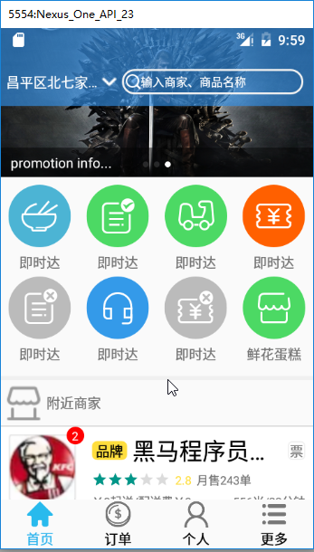
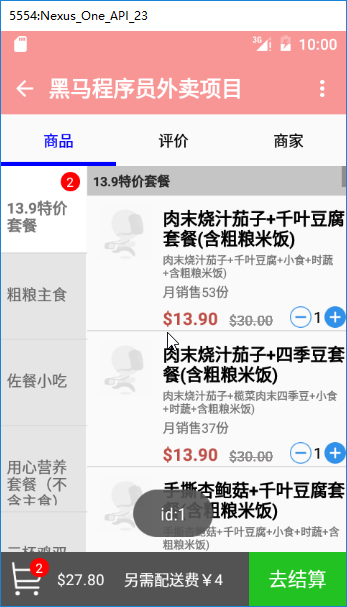

# 026_展示和分析项目效果
## 学习目标
- 了解外卖项目的功能模块
- 思考功能模块的实现方案

## 引言和回顾
到此，外卖这个项目的框架基本算搭建完成，下面我们先来外卖这个项目做好之后的效果，熟悉各个功能模块

## 课堂内容
### 1.主页面

1. tab页面内容：首页、订单、个人、更多
    
    首页
        1. 沉浸式状态栏
        2. 可变色 Title 栏
        3. 广告轮播图 
        4. 功能模块
        5. 商家列表

2. tab 栏

### 2.商铺页

1. 商品列表

    1. 商品分类列表
    2. 商品列表
    3. 购物车信息

2. 评价
3. 商铺详情
