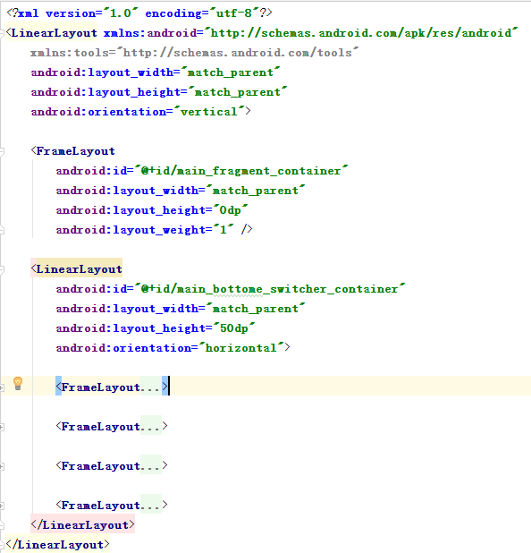

# 027_实现首页Tab
## 学习目标
- 使用组合控件自定义 tab 栏
- 理解 ViewGroup 保存子节点 View 的方式

## 学习基础要求
- android 基本控件的使用

## 引言和回顾
框架搭建完成之后，我们就可以开始项目的功能模块了，我们从主页面这个功能模块开始，首先我们来实现主页面底部这个 tab 栏切换效果，在新闻客户端项目中我们使用 RadioGroup + RadioButton 来实现 tab 栏切换效果，这种方式方便是方便，由于已经封装好了，使用起来没有那么灵活，这里我们就换一种方式，自己使用控件组合来实现 tab 栏切换效果

## 课堂内容
完成 tab 栏切换效果
### 1.设置 MainActivity 布局



### 2.添加布局中使用的资源
copy drawable、drawable-hdpi、color 中的文件

### 3.给 tab 栏设置点击事件
1. 遍历 tab 栏 view 容器中所有子view，设置点击事件
2. 在点击事件中更新 tab 栏选中的 tab 的 UI 效果
3. 递归设置每个 tab 的 enable 状态，配合 selector 实现 tab 切换效果
```java
public class MainActivity extends AppCompatActivity {

    @InjectView(R.id.main_fragment_container)
    FrameLayout fragmentContainer;
    @InjectView(R.id.main_bottome_switcher_container)
    LinearLayout switcherContainer;

    @Override
    protected void onCreate(Bundle savedInstanceState) {
        super.onCreate(savedInstanceState);
        setContentView(R.layout.activity_main);
        ButterKnife.inject(this);

        //3.1 遍历 tab 栏 view 容器中所有子view，设置点击事件
        int childCount = switcherContainer.getChildCount();
        for (int i = 0; i < childCount; i++) {
            switcherContainer.getChildAt(i).setOnClickListener(switherOcl);
        }
    }

    private View.OnClickListener switherOcl = new View.OnClickListener() {
        @Override
        public void onClick(View v) {
            //3.2  在点击事件中更新 tab 栏选中的 tab 的 UI 效果
            int index = switcherContainer.indexOfChild(v);
            updateUi(index);
        }
    };

    private void updateUi(int index) {
        Toast.makeText(this, "" + index, Toast.LENGTH_SHORT).show();

        //3.3递归设置 tab view 的 enable 状态，配合 selector 实现 tab 切换效果
        int childCount = switcherContainer.getChildCount();
        for (int i = 0; i < childCount; i++) {
            // 给点中的View设置enable是false属性，可以让它不接受触摸事件，就不会进入onClick点击方法
            setEnabled(switcherContainer.getChildAt(i), index != i);
        }
    }

    // 递归改enable属性
    private void setEnabled(View view, boolean enabled) {
        view.setEnabled(enabled);
        if (view instanceof ViewGroup) {
            for (int i = 0; i < ((ViewGroup) view).getChildCount(); i++) {
                setEnabled(((ViewGroup) view).getChildAt(i), enabled);
            }
        }
    }
}
```


## 问题
1. ViewGroup 是怎么保存内部的儿子 View 的？ViewGroup 把儿子 view 保存在一个数组中

### 练习
1. 实现 tab 栏切换效果(10m)

