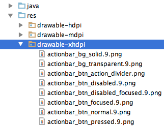

# 028_自动生成Selector工具
## 学习目标
- 使用 selector 自动生成工具产生 selector 文件

## 学习基础要求
- 理解 selector 的作用
- 掌握 android studio 的基本使用
- 能够安装 android studio 插件

## 引言和回顾
刚刚实现 tab 栏我们用到了 selector，每次都手动写 selector 比较麻烦，有位雷锋同志就为大家开发了一个 android studio 插件，可以根据 drawable 目录下图片的命名规则自动产生 selector 文件，估计有的同学前面已经使用过这个工具，下面我们一起来学习一下怎么使用这个工具

## 课堂内容
### 1. SelectorChapek for Android 插件的安装

### 2. 使用 SelectorChapek for Android 的图片命名规则

### 3. 使用 SelectorChapek for Android
3.1. 右键单击 drawable 目录

3.2. 点击 generate android selectors

3.3. 在drawable目录下就可以看到自动产生的selector文件了

## 重点难点讲解

## 问题和练习
### 问题

### 练习
1. 安装和使用 SelectorChapek for Android 产生 selector

## 拓展和参考资料
