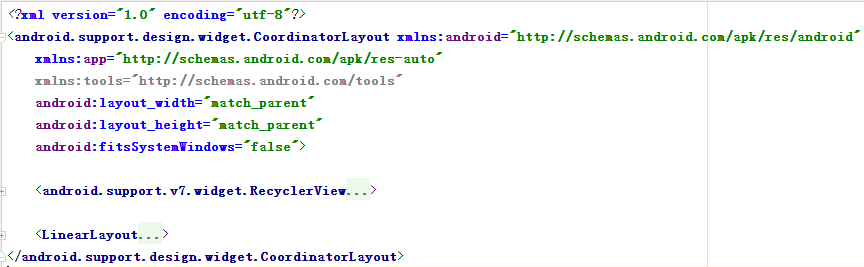

# 030_分析HomeFragment布局
## 学习目标
- 根据首页UI效果设计 HomeFragment 布局
- 根据首页UI效果设计 HomeFragment 要实现的 UI 控制逻辑

## 学习基础要求

## 引言和回顾

## 课堂内容
### 1. HomeFragment 布局分析

### 2. UI 控制逻辑分析
1. 头容器的处理
    a. 需要侵入到状态栏中
    b. 状态栏为半透明效果
    c. 随着 RecyclerView 的滑动，透明度变化

2. RecyclerView 数据的填充

## 重点难点讲解

## 问题和练习
### 问题
1. HomeFragment 要对 View 做哪些控制？

### 练习

## 拓展和参考资料

## 视频问题