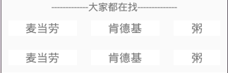
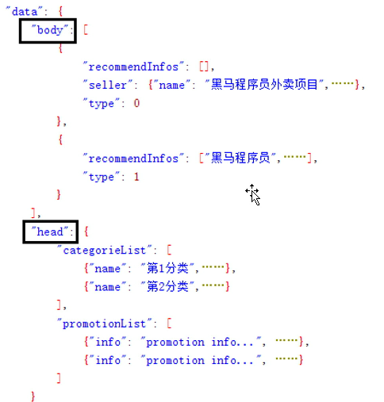

# 033_分析首页RecyclerView显示
## 学习目标
正确划分多种类型 Item RecyclerView 的 Item

## 学习基础要求
- 熟练使用多种类型 item 的 ListView

## 引言和回顾
下面我们就可以开始来实现 HomeFragment 中 RecyclerView 的数据填充啦，实现 RecyclerView 的主要工作量就是定义 adapter 这个类，定义 adapter 类主要实现哪几个方法：

1. onCreateViewHolder
2. onBindViewHolder
3. getCount

如果有多种类型的 Item 还要实现

4. getItemViewType

大家前面已经看到我们这个 RecyclerView 比较复杂，主要是内部的 Item 种类比较多，所以先一起来分析一下这个 RecyclerView 中的 Item 种类

## 课堂内容
### 1. 分析 RecyclerView 有多少种 item 构成
可以拆分为 3 种类型的 item
第一种

第二种商家

第三种分割线

### 2. 分析 RecyclerView item 排布规律

RecyclerView 中的数据

- position 为 0  是一种 item
- position为其他值，type 为 0 是第二种 item
- position为其他值，type 为 1 是第三种 item

## 重点难点讲解

## 问题和练习
### 问题
getItemViewType 方法返回值如何取值？

### 练习

## 拓展和参考资料
