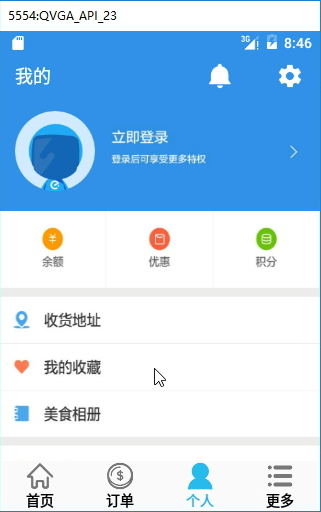
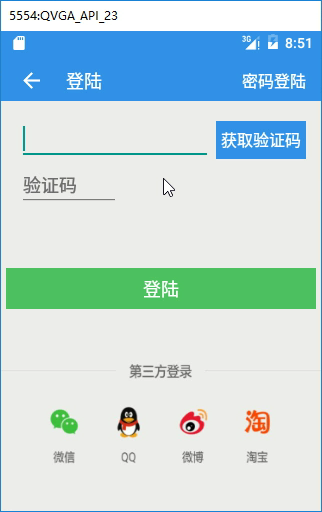

# 061_展示用户信息及分析登陆界面功能
## 学习目标

## 学习基础要求

## 引言和回顾
分析用户信息展示界面和用户登录界面的功能及实现步骤

## 课堂内容
### 1. 分析用户信息界面

用户信息展示：

1. 判断用户是否已经登录，使用一个变量来保存用户的 id，如果用户已经登录，变量的值为用户的 id，否则为默认值；其他的用户信息可以保存在数据库中。
2. 用户没有登录，用户信息界面显示登录的入口。
3. 用户已经登录，查询用户信息，用户信息界面显示用户信息。

### 2. 分析登录界面

用户登录界面实现步骤：

1. 引入短信校验相关工具；
2. 获取短信校验码；
    2.1. 等待倒计时处理；
3. 发送验证码；
4. 把手机号码发送到自己的服务器，做注册或者登录操作。

## 重点难点讲解

## 问题和练习

### 问题

### 练习

## 拓展和参考资料
