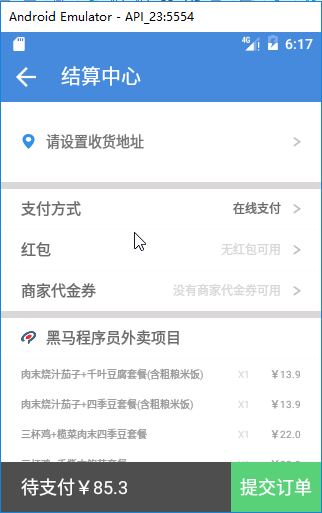
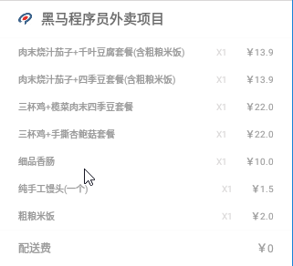

# 067_结算中心功能列表
## 学习目标

## 学习基础要求

## 引言和回顾

分析结算中心功能，点击结算按钮，打开结算中心



## 课堂内容
### 1. 结算中心功能分析
设置收货地址


设置支付信息


购物车商品列表



总结算信息


### 2. 完成购物车结算按钮点击事件处理
```java
public class CartActivity extends AppCompatActivity {
    ....

    @OnClick(R.id.button)
    public void onClick() {
        // 判断是否登陆了
        // 如果登陆了，去订单生成界面
        // 没有登陆，去用户登陆界面
        Intent intent =null;
        if(MyApplication.USERID!=0){
            // 如果登陆了，去订单生成界面
            intent = new Intent(this, SettleCenterActivity.class);
        }else{
            // 没有登陆，去用户登陆界面
            intent = new Intent(this, LoginActivity.class);
        }
        startActivity(intent);
    }
}
```

- 如果登陆了，去订单生成界面；
- 没有登陆，去用户登陆界面。

### 3. 定义订单生成 Activity
```java
/**
 * 结算中心
 */
public class SettleCenterActivity extends AppCompatActivity {

    // 功能列表
    // 1.布局
    // 2.地址管理入口
    // 3.设置购物车数据

    @Override
    protected void onCreate(Bundle savedInstanceState) {
        super.onCreate(savedInstanceState);
        setContentView(R.layout.activity_settle_center);
    }
}
```

## 重点难点讲解

## 问题和练习

### 问题

### 练习

## 拓展和参考资料
