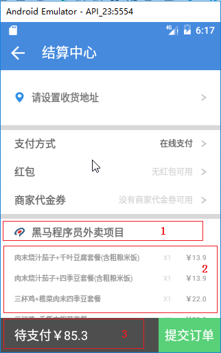

# 068_处理数据展示
## 学习目标

## 学习基础要求

## 引言和回顾
设置订单页面要展示的数据

## 课堂内容
### 1. 展示订单数据
```java
/**
 * 结算中心
 */
public class SettleCenterActivity extends AppCompatActivity {
    @InjectView(R.id.ib_back)
    ImageButton ibBack;
    @InjectView(R.id.tv_name)
    TextView tvName;
    @InjectView(R.id.tv_sex)
    TextView tvSex;
    @InjectView(R.id.tv_phone)
    TextView tvPhone;
    @InjectView(R.id.tv_label)
    TextView tvLabel;
    @InjectView(R.id.tv_address)
    TextView tvAddress;
    @InjectView(R.id.ll_selected_address_container)
    LinearLayout llSelectedAddressContainer;
    @InjectView(R.id.tv_select_address)
    TextView tvSelectAddress;
    @InjectView(R.id.rl_location)
    RelativeLayout rlLocation;
    @InjectView(R.id.iv_logo)
    ImageView ivLogo;
    @InjectView(R.id.tv_seller_name)
    TextView tvSellerName;
    @InjectView(R.id.ll_select_goods)
    LinearLayout llSelectGoods;
    @InjectView(R.id.tv_send_price)
    TextView tvSendPrice;
    @InjectView(R.id.tv_count_price)
    TextView tvCountPrice;
    @InjectView(R.id.tv_submit)
    TextView tvSubmit;

    // TODO 地址工作：
    // 1.到数据库中获取地址列表的数据
    // 2.展示默认地址（默认地址不是用户设置）   应用在首页会有定位（经纬度信息）
    // 在地址中会存放经纬度信息，依据获取到的用户位置信息和地址列表中的位置信息进行比对
    // 计算两个点之间的距离：一旦距离小于200米，将当前的比对地址作为默认地址
    // 3.用户手动设置地址

    @Override
    protected void onCreate(Bundle savedInstanceState) {
        super.onCreate(savedInstanceState);
        setContentView(R.layout.activity_settle_center);
        ButterKnife.inject(this);

        setData();
    }

    private void setData() {
        // 设置商家
        // 设置购买商品
        // 配送费设置
        // 支付总额设置

        ivLogo.setImageResource(R.drawable.item_logo);
        tvSellerName.setText(ShoppingCartManager.getInstance().name);

        CopyOnWriteArrayList<GoodsInfo> goodsInfos = ShoppingCartManager.getInstance().goodsInfos;
        for (GoodsInfo item : goodsInfos) {
            View v = View.inflate(this, R.layout.item_settle_center_goods, null);
            // 数据设置
            ((TextView)v.findViewById(R.id.tv_name)).setText(item.name);
            ((TextView)v.findViewById(R.id.tv_count)).setText("X"+item.count);
            ((TextView)v.findViewById(R.id.tv_price)).setText("￥"+item.newPrice);
            // android:layout_width="match_parent" android:layout_height="30dp"
            int h = (int) TypedValue.applyDimension(TypedValue.COMPLEX_UNIT_DIP, 30, getResources().getDisplayMetrics());
            llSelectGoods.addView(v, ViewGroup.LayoutParams.MATCH_PARENT,h);
        }

        tvSendPrice.setText("￥"+ShoppingCartManager.getInstance().sendPrice);

        float money=ShoppingCartManager.getInstance().getMoney()/100.0f+ShoppingCartManager.getInstance().sendPrice;
        tvCountPrice.setText("待支付￥"+money);
    }

    @OnClick({R.id.ib_back, R.id.rl_location, R.id.tv_submit})
    public void onClick(View view) {
        switch (view.getId()) {
            case R.id.ib_back:
                break;
            case R.id.rl_location:
                // TODO 地址管理入口
                break;
            case R.id.tv_submit:
                break;
        }
    }
}
```

- 设置商铺图标和商铺名字
- 设置订单中的商品列表
- 设置配送费用
- 设置总价



## 重点难点讲解

## 问题和练习

### 问题

### 练习

## 拓展和参考资料
