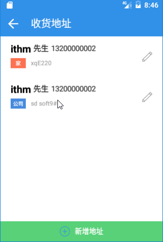
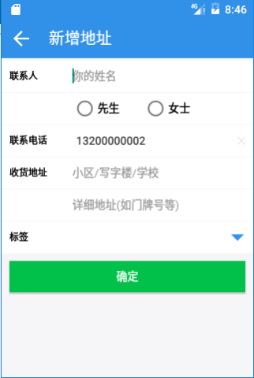
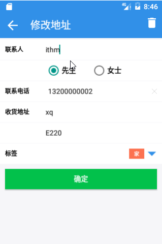

# 069_完整的地址功能
## 学习目标

## 学习基础要求

## 引言和回顾
分析地址列表功能

## 课堂内容
### 1. 分析地址列表功能
1. 到数据库中获取地址列表的数据，展示地址列表；
2. 展示默认地址（默认地址不是用户设置），在应用在首页会有定位（经纬度信息）
在地址中会存放经纬度信息，对比获取到的用户位置信息和地址列表中的位置信息，
计算两个点之间的距离：一旦距离小于200米，将当前的比对地址作为默认地址；
3. 用户手动设置地址。

## 重点难点讲解

## 问题和练习

### 问题

### 练习

## 拓展和参考资料
